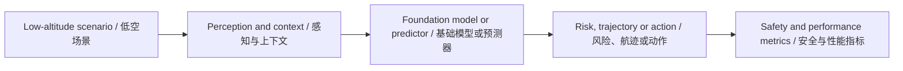

# 低空经济通用大模型前沿论文库 - 2026-07-13

> 此文件由自动化生成。它是待复核的外部情报，不是已经验证的科研结论。

## 数据源状态

- Towards Reliable Aerial Ground Vehicle Collaboration: An Integrated Planning and Autonomy Framework for Field Deployment: PDF exceeds 26214400 bytes
- Only 3 of 10 papers had a downloadable, extractable PDF

## 今日核心发现

- 候选论文 4 篇；成功完成 PDF 全文提取与页码校验 3 篇。
- 主题分布以 Foundation/LLM 为主。
- 所有数值、数据集、Baseline 与局限仅在存在可回查英文证据片段时展示。

## Top 10 阅读优先级

| 排名 | 中文标题 | English Title | 全文状态 | 核心图 |
| ---: | --- | --- | --- | --- |
| 1 | 面向无人机航空机器人与双臂操作的视觉-语言-动作（VLA）模型综述 | Vision Language Action (VLA) Models for Unmanned Aerial Robotics and Bimanual Manipulation: A Review | verified_first_40_pages | found |
| 2 | UAV-OVVIS：无人机也需要开放词汇视频实例分割 | UAV-OVVIS: Unmanned Aerial Vehicles Also Need Open-Vocabulary Video Instance Segmentation | verified | found |
| 3 | 无人机末米精度导航：一种扩散精化空中视觉伺服方法 | Last-Meter Precision Navigation for UAVs: A Diffusion-Refined Aerial Visual Servoing Approach | verified | found |

## 主题与方法分布

<svg xmlns="http://www.w3.org/2000/svg" viewBox="0 0 760 88" role="img" aria-label="Topic and Method Distribution / 主题与方法分布" style="max-width:100%;background:#0f172a;border-radius:12px"><text x="16" y="26" fill="#f8fafc" font-size="17" font-weight="700">Topic and Method Distribution / 主题与方法分布</text><text x="16" y="58" fill="#cbd5e1" font-size="14">Foundation/LLM</text><rect x="180" y="42" width="500" height="20" rx="5" fill="#2dd4bf"/><text x="690" y="58" fill="#e2e8f0" font-size="13">4</text></svg>

## 证据深度统计

<svg xmlns="http://www.w3.org/2000/svg" viewBox="0 0 760 122" role="img" aria-label="Evidence Depth / 证据深度" style="max-width:100%;background:#0f172a;border-radius:12px"><text x="16" y="26" fill="#f8fafc" font-size="17" font-weight="700">Evidence Depth / 证据深度</text><text x="16" y="58" fill="#cbd5e1" font-size="14">全文核验</text><rect x="180" y="42" width="500" height="20" rx="5" fill="#2dd4bf"/><text x="690" y="58" fill="#e2e8f0" font-size="13">3</text><text x="16" y="92" fill="#cbd5e1" font-size="14">摘要级</text><rect x="180" y="76" width="166" height="20" rx="5" fill="#2dd4bf"/><text x="356" y="92" fill="#e2e8f0" font-size="13">1</text></svg>

## 当日整体技术路线图



## 研究空白与实验建议

1. 统一比较跨场景泛化：固定数据划分，比较 in-domain、cross-city 与极端天气性能。
2. 补齐不确定性与安全闭环：同时报告预测误差、校准误差、碰撞/冲突风险和推理延迟。
3. 检验通用模型的真实增益：以轻量专用模型为 Baseline，做参数量、数据规模、工具调用与消融实验。

网页版本：https://smallopen123.github.io/mobile-paper-library/2026-07-13/

## Top 1. 面向无人机航空机器人与双臂操作的视觉-语言-动作（VLA）模型综述

**English Title:** Vision Language Action (VLA) Models for Unmanned Aerial Robotics and Bimanual Manipulation: A Review

- Authors: Inkyu Sa, Chanoh Park, Hea-Min Lee, Donghee Noh, Ho Seok Ahn
- Source: arXiv cs.RO
- Published: 2026-07-07T18:24:09Z
- [Original Page](http://arxiv.org/abs/2607.06706v1) | [Available PDF](http://arxiv.org/pdf/2607.06706v1)
- Evidence scope: `fulltext_first_40_pages`；分析引用页：1、2、3、4、5、6、7、8、9、10、11、12、13、14、15、16、17、18、19、20、21、22、23、24、25、26、27、28、29、30、31、32、33、34、35、36、37、38、39、40

### 中文摘要

视觉-语言-动作（VLA）模型将视觉感知、自然语言理解和动作生成统一在一个基础模型中，使机器人能够直接根据摄像头图像执行诸如“折叠毛巾”或“飞向红色建筑”等指令。由于VLA继承了互联网规模预训练的世界知识，它们已成为基于学习的操作的主导框架，而双臂协调则是最具挑战性的试验平台：两个各有7个自由度的机械臂必须协同运动以完成折叠、组装和重新定向物体等任务。无人机航空机器人面临结构上相似的挑战：无人机必须在严格的延迟和有效载荷约束下，根据视觉观测协调推力、姿态以及日益增加的夹爪指令。本综述涵盖了2017年至2026年间的183篇文献，并沿七个维度组织：VLA架构、训练方法、动作表示、双臂协调（2022-2026年）、无人机导航与控制（2017-2026年）、语言基础以及包括记忆和世界模型在内的交叉问题。我们展示了为双臂VLA开发的协调策略、训练方法和动作表示可迁移至无人机系统，并确定了两个领域的十四个研究方向。

> [!info]- English Abstract
> Vision Language Action (VLA) models unify visual perception, natural-language understanding, and action generation within a single foundation model, allowing a robot to follow instructions such as fold the towel or fly to the red building directly from camera images. Because VLAs inherit world knowledge from internet-scale pre-training, they have become the dominant framework for learning-based manipulation, with bimanual coordination serving as the most demanding testbed: two arms with 7 degrees of freedom each must move in concert to fold, assemble, and reorient objects. Unmanned aerial robotics faces a structurally similar challenge: a drone must coordinate thrust, attitude, and increasingly gripper commands from visual observations under strict latency and payload constraints. This review covers 183 contributions spanning 2017-2026 and organized along seven dimensions: VLA architectures, training recipes, action representations, bimanual coordination (2022-2026), unmanned aerial vehicle (UAV) navigation and control (2017-2026), language grounding, and cross-cutting concerns including memory and world models. We show that the coordination strategies, training recipes, and action representations developed for bimanual VLAs transfer to unmanned aerial systems and identify fourteen research directions across both domains.

### 论文原始核心框图

<!-- CORE_FIGURE:e7209774867e3454 -->
- Figure: Figure 1；PDF 第 4 页
- English Caption: Figure 1. Taxonomy of VLA models for bimanual manipulation and unmanned aerial robotics. This review is organized along five major dimensions: architectural foundations (autoregressive, flow- based, diffusion-based, hybrid), training recipes (pre-training, post-training, reinforcement learning), action representations (discrete tokenization, continuous generation), bimanual-specific concerns (coordination strategies, task types), and unmanned aerial robotics (navigation, aerial manipulation, multi-agent unmanned systems). Each branch is covered in a dedicated section.
- 中文 Caption: 图1. 面向双臂操作和无人机航空机器人的VLA模型分类法。本综述沿五个主要维度组织：架构基础（自回归、流匹配、扩散、混合）、训练方法（预训练、后训练、强化学习）、动作表示（离散令牌化、连续生成）、双臂特定问题（协调策略、任务类型）以及无人机航空机器人（导航、空中操作、多智能体无人机系统）。每个分支在专门章节中讨论。
- 选择理由：Caption 命中 system；正文引用约 6 次；按标题匹配、引用次数和图形面积综合排序。

### AI 中文总结框图

> AI 总结框图，不是论文原图；依据论文第 4、5、6、12、22、23 页生成。

```mermaid
flowchart LR N0["输入/场景: 摄像头图像 + 语言指令 + 本体感知状态"] N1["核心模块: VLA架构 (自回归/流匹配/扩散/混合) + 动作头"] N2["机制: 动作分块 (Action Chunking) + 流匹配/扩散去噪"] N3["输出: 连续动作块 (Action Chunk) 或离散动作令牌"] N4["指标: Task success rate, Inference latency, Data efficiency, Generalization ratio"] N0 --> N1 N1 --> N2 N2 --> N3 N3 --> N4
```

### 核心内容

- **研究问题：** VLA模型如何统一应用于双臂操作和无人机航空机器人这两个具身领域，以及为双臂系统开发的架构、训练方法和动作表示能否有效迁移到无人机系统？
- **核心假设：** 未明确陈述核心假设，但隐含假设为：双臂VLA的协调策略、训练方法和动作表示可直接迁移至无人机系统，因为两者面临结构相似的协调问题。
- **方法与理论链路：** VLA框架（视觉编码器fvis → VLM骨干fVLM → 动作头fact）→ 动作分块（Action Chunking）→ 流匹配/扩散/自回归动作生成 → 三阶段训练（预训练、后训练、强化学习）→ 双臂协调策略（联合动作空间、层次化、主从）→ 无人机导航与控制（视觉语言导航、端到端飞行、空中操作）→ 跨领域迁移分析
- **为什么前沿：** 首次将双臂操作和无人机航空机器人作为同一VLA问题的两个实例进行统一综述，填补了现有综述未同时覆盖这两个领域的空白；涵盖了截至2026年初的最新VLA架构（如流匹配、混合模型）和训练策略（如RECAP强化学习）。

### 数据集、Baselines 与 Metrics

**Datasets**
- DROID（PDF 第 10 页；证据："DROID [50] provides 76,000 trajectories collected across 564 scenes and 86 tasks using Franka Emika arms."）
- BridgeData V2（PDF 第 10 页；证据："BridgeData V2 [51], building on the original BridgeData [52] that first demonstrated cross-domain dataset boosting, contains 60,096 trajectories from a WidowX robot performing tabletop manipulation tasks across 24 environments."）
- GigaBrain-0.5M（PDF 第 10 页；证据："GigaBrain-0.5M [53] is a recent large-scale dataset containing 500,000 episodes collected via a combination of teleoperation and autonomous data collection."）

**Baselines**
- ACT（PDF 第 6 页；证据："Action chunking, introduced in the context of ACT [16], offers two key advantages."）

**Metrics**
- Task success rate（PDF 第 11 页；证据："Task success rate is the primary metric, defined as the fraction of N evaluation episodes in which the robot completes the specified task."）
- Inference latency（PDF 第 11 页；证据："Inference latency measures the wall-clock time for a single action chunk prediction, critical for real-time control."）
- Data efficiency（PDF 第 11 页；证据："Data efficiency tracks how many demonstrations are required to reach a target success rate, relevant for bimanual tasks where data collection is expensive."）
- Generalization ratio（PDF 第 11 页；证据："Generalization metrics assess whether the VLA transfers to novel settings: Gen(πθ) = SRnovel / SRtrain."）

### 主要结果与页码

- CognitiveDrone的VLM推理增益（PDF 第 32 页；证据："Its R1 variant adds VLM-based chain-of-thought reasoning before acting, which lifts the success rate to 77.2%, a 30% gain."）
- UAV-VLA的规划速度（PDF 第 31 页；证据："On a 100K-mission dataset, it produces plans 6.5× faster than human operators at comparable quality."）
- GigaBrain-0.5M的双臂任务改进（PDF 第 40 页；证据："Its successor, GigaBrain-0.5M [53], added RAMP (RL via World Model-conditioned Policy), yielding ∼30% improvement on bimanual tasks."）

### 局限与证据边界

- π0的专有数据依赖（PDF 第 14 页；证据："A significant limitation is that π0's strongest results depend on proprietary multi-task data collected across Physical Intelligence's robot fleet; reproducing these results with publicly available data alone has not been demonstrated."）
- 多无人机VLA缺乏物理硬件验证（PDF 第 34 页；证据："However, no multi-drone VLA has been demonstrated on physical hardware; all results remain simulation-only."）
- 空中操作VLA的简化任务测试（PDF 第 33 页；证据："A significant gap remains, however: all current aerial manipulation VLAs have been tested only on simplified pick-and-place tasks with lightweight objects."）

- **与研究方向的联系：** 论文标题和摘要明确聚焦于无人机航空机器人和双臂操作中的VLA模型，完全符合研究范围中“低空场景中的VLA”和“无人机/城市空中交通语境”的要求；论文系统性地综述了VLA在无人机导航、控制、空中操作和多智能体系统中的应用。
- **可复现方案：** 可复现条件：使用公开数据集（如OXE、DROID、BridgeData V2）和开源模型（如OpenVLA、Octo）。最小复现实验：在ALOHA双臂平台上使用ACT方法训练一个VLA策略，执行折叠毛巾任务，评估任务成功率。
- **博士研究构想：** 假设：在无人机空中操作任务中，采用联合动作空间（Joint Action Space）的VLA策略（如π0）比采用独立动作空间（Independent）的策略在协调无人机本体与机械臂动作时具有更高的任务成功率和更低的碰撞率。实验：在Flying Hand平台上，分别训练使用联合动作空间和独立动作空间的VLA策略，执行空中抓取和放置任务，比较任务成功率和碰撞次数。

## Top 2. UAV-OVVIS：无人机也需要开放词汇视频实例分割

**English Title:** UAV-OVVIS: Unmanned Aerial Vehicles Also Need Open-Vocabulary Video Instance Segmentation

- Authors: Mingyu Dou, Shi Qiu, Ming Hu, Yifan Chen, Zhe Sun
- Source: arXiv cs.CV
- Published: 2026-07-09T03:08:33Z
- [Original Page](http://arxiv.org/abs/2607.08075v1) | [Available PDF](http://arxiv.org/pdf/2607.08075v1)
- Evidence scope: `fulltext`；分析引用页：1、2、3、4、5、6、7、8、9

### 中文摘要

无人机视频广泛应用于交通监控、城市管理和应急响应。然而，现有的无人机视频感知主要依赖于预定义类别下的框级定位和轨迹关联，难以在开放场景中同时支持灵活查询和细粒度实例级动态理解。为此，我们引入了一个新任务——无人机开放词汇视频实例分割（UAV-OVVIS），该任务根据开放词汇查询发现无人机视频中的目标，并输出具有全局一致身份的实例级分割轨迹。考虑到无人机场景中实例级标注的稀缺性，我们提出了AeroTrack，一个无需训练的统一框架。AeroTrack以周期性开放词汇检测、短片段掩码传播和跨片段身份统一为核心，重用现有的视觉基础模型以实现UAV-OVVIS。基于该框架，我们实例化了五种AeroTrack变体，并构建了AeroVIS，一个包含9个无人机目标类别和8,279条轨迹的UAV-OVVIS评估基准。实验表明，AeroTrack在无人机场景中显著优于现有的通用视频实例分割方法，并展现出强大的开放词汇鲁棒性和泛化能力。为支持未来研究，我们发布了AeroTrack和AeroVIS作为UAV-OVVIS的统一框架和基准。

> [!info]- English Abstract
> Unmanned Aerial Vehicle (UAV) videos are widely used in traffic monitoring, urban management, and emergency rescue. However, existing UAV video perception mainly relies on box-level localization and trajectory association under predefined categories, making it difficult to simultaneously support flexible queries and fine-grained instance-level dynamic understanding in open scenarios. To this end, we introduce a new task, UAV Open-Vocabulary Video Instance Segmentation (UAV-OVVIS), which discovers targets in UAV videos according to open-vocabulary queries and outputs instance-level segmentation trajectories with globally consistent identities. Considering the scarcity of instance-level annotations in UAV scenarios, we propose AeroTrack, a training-free unified framework. AeroTrack centers on periodic open-vocabulary detection, short-segment mask propagation, and cross-segment identity unification, reusing existing visual foundation models to enable UAV-OVVIS. Based on this framework, we instantiate five AeroTrack variants and construct AeroVIS, an evaluation benchmark for UAV-OVVIS containing 9 UAV object categories and 8,279 trajectories. Experiments show that AeroTrack substantially outperforms existing general video instance segmentation methods in UAV scenarios and demonstrates strong open-vocabulary robustness and generalization. To support future research, we release AeroTrack and AeroVIS as a unified framework and benchmark for UAV-OVVIS.

### 论文原始核心框图

<!-- CORE_FIGURE:c47b86f3ffb28893 -->
- Figure: Figure 2；PDF 第 3 页
- English Caption: Figure 2: Overview of the AeroTrack framework. Given a UAV video and open-vocabulary text queries, (a) the Recognizer uses Grounding DINO, YOLO-World, SAM3, or other models as the open-vocabulary detection module, performs open-vocabulary detection every ∆frames, and passes positional prompts to the Segmenter. (b) The Segmenter uses SAM2, SAM3, or other promptable video segmenters to perform instance-level segmentation and propagation within each [k, ¯k) segment according to the positional prompts. It outputs instance masks with local IDs and resets the internal Segmenter memory at each ∆boundary. LIA, as an output-level association module, further associates local IDs from different ∆intervals into video-level global IDs, finally producing instance-level segmentation trajectories with globally consistent video identities.
- 中文 Caption: 图2：AeroTrack框架概览。给定一个UAV视频和开放词汇文本查询，(a) 识别器使用Grounding DINO、YOLO-World、SAM3或其他模型作为开放词汇检测模块，每∆帧执行一次开放词汇检测，并将位置提示传递给分割器。(b) 分割器使用SAM2、SAM3或其他可提示视频分割器，根据位置提示在每个[k, ¯k)片段内执行实例级分割和传播。它输出带有局部ID的实例掩码，并在每个∆边界重置内部分割器内存。LIA作为输出级关联模块，进一步将来自不同∆间隔的局部ID关联为视频级全局ID，最终产生具有全局一致视频身份的实例级分割轨迹。
- 选择理由：Caption 命中 framework, overview；正文引用约 3 次；按标题匹配、引用次数和图形面积综合排序。

### AI 中文总结框图

> AI 总结框图，不是论文原图；依据论文第 3、5、7 页生成。

```mermaid
flowchart LR N0["输入/场景：UAV视频 + 开放词汇文本查询"] N1["核心模块：Recognizer（YOLO-World/Grounding DINO/SAM3）周期性开放词汇检测"] N2["核心模块：Segmenter（SAM2/SAM3）短片段掩码生成与传播"] N3["机制：LIA输出级跨片段ID关联，维护全局身份"] N4["输出：实例级分割轨迹（全局一致ID）"] N5["指标：HOTA, mAP, DetA, AssA, Mask J"] N0 --> N1 N1 --> N2 N2 --> N3 N3 --> N4 N4 --> N5
```

### 核心内容

- **研究问题：** 如何在不依赖无人机领域标注或重新训练的情况下，通过重用现有视觉基础模型，实现无人机视频中基于开放词汇查询的实例级分割轨迹输出？
- **核心假设：** 未明确陈述
- **方法与理论链路：** AeroTrack框架将UAV-OVVIS解耦为两个组件：开放词汇识别器（Recognizer）和视频实例分割器（Segmenter）。识别器在关键帧上周期性执行开放词汇检测，生成位置提示；分割器根据位置提示在短视频片段内生成和传播实例掩码，并在片段边界重置内部状态以约束内存和计算成本。进一步设计生命周期感知ID关联（LIA），在输出层关联跨片段局部轨迹，维护全局一致的视频身份。该框架支持识别器和分割器的模块化组合，本文使用YOLO-World、Grounding DINO和SAM3作为识别器，SAM2和SAM3作为分割器，实例化五种代表性组合。
- **为什么前沿：** 首次提出无人机开放词汇视频实例分割（UAV-OVVIS）任务，实现4W无人机视觉感知（何时、何地、什么目标、哪个实例）；提出无需训练的AeroTrack框架，通过解耦和模块化组合重用现有视觉基础模型；构建首个UAV-OVVIS评估基准AeroVIS。

### 数据集、Baselines 与 Metrics

**Datasets**
- AeroVIS（PDF 第 6 页；证据："AeroVIS contains 117 videos, 49,204 frames, 9 UAV object categories, and 8,279 valid trajectories."）

**Baselines**
- DEVA（PDF 第 7 页；证据："DEVA (Cheng et al. 2023)"）
- GLEE（PDF 第 7 页；证据："GLEE (Wu et al. 2024)"）
- OV2Seg（PDF 第 7 页；证据："OV2Seg (Wang et al. 2023)"）
- CLIP-VIS（PDF 第 7 页；证据："CLIP-VIS (Zhu et al. 2024)"）
- OVFormer（PDF 第 7 页；证据："OVFormer (Fang et al. 2024)"）
- SAM3（PDF 第 7 页；证据："SAM3 (Carion et al. 2025)"）
- BriVIS（PDF 第 8 页；证据："BriVIS (Cheng et al. 2024b)"）
- Troy-VIS（PDF 第 8 页；证据："Troy-VIS (Yan et al. 2024)"）
- OpenVIS（PDF 第 8 页；证据："OpenVIS (Guo et al. 2025)"）

**Metrics**
- HOTA（PDF 第 7 页；证据："Per-category columns report HOTA."）
- mAP（PDF 第 7 页；证据："Overall metrics aggregate mAP, DetA, AssA, Mask J, and HOTA"）
- DetA（PDF 第 7 页；证据："Overall metrics aggregate mAP, DetA, AssA, Mask J, and HOTA"）
- AssA（PDF 第 7 页；证据："Overall metrics aggregate mAP, DetA, AssA, Mask J, and HOTA"）
- Mask J（PDF 第 7 页；证据："Overall metrics aggregate mAP, DetA, AssA, Mask J, and HOTA"）

### 主要结果与页码

- 未从可核验原文片段中确认。

### 局限与证据边界

- 依赖现有VFM的领域差距（PDF 第 4 页；证据："Although UAV viewpoints introduce domain gaps such as small objects, top-down perspectives, and camera motion, the general visual representations learned by these models still have the potential to transfer across scenarios."）
- LIA的短期关联限制（PDF 第 5 页；证据："LIA is neither an appearance re-identification module nor a long-term tracking module. Its role is to repair local ID fragmentation caused by segment restarts, short-term occlusions, or propagation interruptions."）
- AeroVIS类别覆盖有限（PDF 第 6 页；证据："AeroVIS contains 117 videos, 49,204 frames, 9 UAV object categories, and 8,279 valid trajectories."）

- **与研究方向的联系：** 论文聚焦于低空场景（无人机视频）中的开放词汇视频实例分割，涉及视觉基础模型（如SAM2、SAM3、Grounding DINO、YOLO-World）的重用，属于低空场景与通用大模型/基础模型的交叉研究，符合研究范围。
- **可复现方案：** 可复现条件：代码已开源（https://github.com/Dmygithub/AeroTrack），使用YOLO-World、Grounding DINO、SAM2、SAM3等公开模型，AeroVIS数据集基于VisDrone、UAVDT、SeaDronesSee构建。最小复现实验：在AeroVIS数据集上运行YOLO-World + SAM2变体，评估HOTA指标。
- **博士研究构想：** 假设AeroTrack的周期性检测和短片段传播策略在长视频密集目标场景中优于全视频传播，可通过设计对比实验验证：在固定视频长度和目标数量下，比较AeroTrack与Native SAM3的峰值内存和HOTA指标，预期AeroTrack在内存受限时保持更高HOTA。

## Top 3. 无人机末米精度导航：一种扩散精化空中视觉伺服方法

**English Title:** Last-Meter Precision Navigation for UAVs: A Diffusion-Refined Aerial Visual Servoing Approach

- Authors: Yaxuan Li, Jiarui Zeng, Shaofei Huang, Zhedong Zheng
- Source: arXiv cs.CV
- Published: 2026-07-05T15:16:44Z
- [Original Page](http://arxiv.org/abs/2607.04352v1) | [Available PDF](http://arxiv.org/pdf/2607.04352v1)
- Evidence scope: `fulltext`；分析引用页：1、2、3、4、5、6、7、8、9、10、11

### 中文摘要

在这项工作中，我们研究了无人机的末米精度导航，例如使用单目视觉在最后10米内自主到达目标。由于尺度模糊、旋转不连续性以及细粒度空间推理的需求，这项任务具有挑战性。现有方法在大视角变化下常常失败，或缺乏对未见环境的泛化能力。为此，我们提出了DreamNav，一种从粗到细的扩散精化空中视觉伺服框架。在第一粗估计阶段，一个稳健的回归策略采用三角参数化，通过联合建模正弦和余弦分量来预测旋转，有效缓解了由角度周期性引起的优化不稳定性。基于这个粗估计，第二扩散精化阶段利用预训练的世界模型模拟候选动作的未来视觉观测，通过视觉想象过程选择与目标视觉差异最小的轨迹。为了支持严格的评估，我们贡献了PairUAV，一个大规模基准，包含来自University-1652数据集的72个场景中的480万图像对。大量实验表明，DreamNav在准确性和泛化能力上优于强视觉伺服和基础模型基线，并具有对未见场景的零样本迁移能力。

> [!info]- English Abstract
> In this work, we study the last-meter precision navigation for UAVs, e.g., autonomously reaching a target within the final 10 meters using monocular vision. This task is challenging due to scale ambiguity, rotation discontinuities, and the need for fine-grained spatial reasoning. Existing methods often fail under large viewpoint changes or lack generalization to unseen environments. To this end, we propose DreamNav, a coarse-to-fine diffusion-refined aerial visual servoing framework. In the first coarse-estimation stage, a robust regression policy employs a trigonometric parameterization to predict rotation by jointly modeling sine and cosine components, effectively mitigating optimization instabilities caused by angular periodicity. Given this coarse estimate, the second diffusion-refined stage utilizes a pre-trained world model to simulate future visual observations for candidate actions, selecting the trajectory that minimizes visual discrepancy with the target through a process of visual imagination. To support rigorous evaluation, we contribute PairUAV, a large-scale benchmark comprising 4.8 million image pairs across 72 scenes, curated from the University-1652 dataset. Extensive experiments show DreamNav outperforms strong visual servoing and foundation model baselines in accuracy and generalization, with zero-shot transfer to unseen scenes.

### 论文原始核心框图

<!-- CORE_FIGURE:0a1444db2dbd105a -->
- Figure: Figure 2；PDF 第 5 页
- English Caption: Figure 2: Overall architecture of our DreamNav. It consists of two successive stages, i.e., the first Coarse-Estimation Stage and the second Diffusion-Refined Stage. (Top) In the Coarse-Estimation stage, given a source and a target image, we regress a coarse relative pose consisting of the heading angle and range from the source to the target. (Bottom) In the Diffusion-Refined stage, we condition a ControlNet-style latent diffusion model on the source image through the ControlNet hint pathway and on the candidate pose through cross-attention tokens: during training, the ground-truth heading and range together with the source image are used to synthesize the target image via a diffusion loss; during inference, we feed the source image and a set of candidate poses, generate their corresponding views, and select the candidate pose whose synthesized view best matches the target image.
- 中文 Caption: 图2：我们的DreamNav的整体架构。它由两个连续的阶段组成，即第一粗估计阶段和第二扩散精化阶段。（顶部）在粗估计阶段，给定源图像和目标图像，我们回归一个粗粒度的相对姿态，包括从源到目标的航向角和距离。（底部）在扩散精化阶段，我们通过ControlNet提示路径将ControlNet风格的潜在扩散模型条件化在源图像上，并通过交叉注意力令牌条件化在候选姿态上：在训练期间，真实航向和距离与源图像一起用于通过扩散损失合成目标图像；在推理期间，我们输入源图像和一组候选姿态，生成它们对应的视图，并选择其合成视图与目标图像最匹配的候选姿态。
- 选择理由：Caption 命中 architecture；正文引用约 1 次；按标题匹配、引用次数和图形面积综合排序。

### AI 中文总结框图

> AI 总结框图，不是论文原图；依据论文第 5、6、7、8、9 页生成。

```mermaid
flowchart LR N0["输入/场景：源图像和目标图像（512×512单目RGB）"] N1["核心模块：粗估计阶段（三角参数化回归 + ViT骨干）"] N2["机制：预测粗粒度航向角和距离"] N3["核心模块：扩散精化阶段（ControlNet风格潜在扩散模型）"] N4["机制：候选姿态生成（3×3网格）→ 合成未来观测 → 像素级MSE选择最佳匹配"] N5["输出：精化后的航向角和距离"] N6["指标：MAER, MAEH, AVG, SR"] N0 --> N1 N1 --> N2 N2 --> N3 N3 --> N4 N4 --> N5 N5 --> N6
```

### 核心内容

- **研究问题：** 如何实现无人机在最后10米内的末米精度导航，特别是在存在尺度模糊、旋转不连续性和细粒度空间推理挑战的情况下？
- **核心假设：** 未明确陈述
- **方法与理论链路：** DreamNav框架包含两个阶段：第一阶段（粗估计阶段）采用三角参数化（联合回归正弦和余弦分量）的稳健回归策略，基于ViT骨干网络预测粗粒度的航向角和距离；第二阶段（扩散精化阶段）利用ControlNet风格的潜在扩散模型（预训练世界模型）对候选动作进行视觉想象，通过合成未来观测并与目标图像比较，选择最优轨迹。
- **为什么前沿：** 该研究首次将扩散模型用于无人机视觉伺服中的末米精度导航，提出了一个从粗到细的框架，结合了三角参数化回归和基于世界模型的视觉想象，并在大规模新基准PairUAV上展示了优越的零样本泛化能力。

### 数据集、Baselines 与 Metrics

**Datasets**
- PairUAV（PDF 第 1 页；证据："we contribute PairUAV, a large-scale benchmark comprising 4.8 million image pairs across 72 scenes, curated from the University-1652 dataset."）
- University-1652（PDF 第 4 页；证据："We build upon the University-1652 dataset Zheng et al. (2020), adopting its established protocol and 3D environments, which span 1,652 buildings across 72 universities."）

**Baselines**
- AI2THOR（PDF 第 9 页；证据："AI2THOR (Zhu et al., 2017)"）
- DINOv3-ViT7b（PDF 第 9 页；证据："DINOv3 Sim´eoni et al. (2025)"）
- Sample4Geo（PDF 第 9 页；证据："Sample4Geo Deuser et al. (2023)"）

**Metrics**
- MAER (Mean Absolute Error for Range)（PDF 第 9 页；证据："MAER and MAEH denote the Mean Absolute Error for Range and Heading, respectively."）
- MAEH (Mean Absolute Error for Heading)（PDF 第 9 页；证据："MAER and MAEH denote the Mean Absolute Error for Range and Heading, respectively."）
- AVG（PDF 第 9 页；证据："AVG is the average of the two."）
- SR (Success Rate)（PDF 第 9 页；证据："success rate (SR)"）

### 主要结果与页码

- 未从可核验原文片段中确认。

### 局限与证据边界

- 范围误差不是最低（PDF 第 9 页；证据："Although our method does not obtain the lowest range error, heading estimation plays a more critical role in determining navigation success"）

- **与研究方向的联系：** 该论文直接涉及低空场景（无人机）中的大规模预训练方法（扩散模型、世界模型）和视觉伺服，属于博士研究重点中的低空场景与通用大模型/基础模型交叉领域。
- **可复现方案：** 代码和数据集已公开（https://github.com/YaxuanLi-cn/PairUAV.git 和 https://huggingface.co/datasets/YaxuanLi/pairUAV/tree/main）。最小复现实验：在PairUAV数据集上，使用ViT骨干网络和三角参数化损失训练第一阶段，然后使用ControlNet风格的扩散模型（冻结VAE和大部分扩散骨干，仅微调姿态编码器、LoRA适配器和ControlNet提示路径）进行第二阶段精化，评估指标为MAER、MAEH和SR。
- **博士研究构想：** 可证伪的博士研究构想：在低空无人机导航中，引入时空基础模型（如Video World Model）替代静态图像扩散模型，通过预测连续帧序列来增强对动态环境（如移动障碍物、光照变化）的鲁棒性，并验证其在PairUAV扩展数据集上的性能提升。

## 其余候选（摘要级，默认折叠）

> [!info]- 4. 迈向可靠的空地车辆协作：面向现场部署的集成规划与自主框架
> - English Title: Towards Reliable Aerial Ground Vehicle Collaboration: An Integrated Planning and Autonomy Framework for Field Deployment
> - 中文摘要：有限的飞行续航显著限制了无人机在长时间任务（如监视和检查）中的作业范围，这些任务需要访问多个空间分布的兴趣区域。这些任务需要高效的路径规划来确定访问顺序，这直接影响任务时间、能耗和整体可行性。将无人机与无人地面车辆配对进行移动充电提供了一种有前景的解决方案，但引入了一个紧密耦合的协作路径规划问题，涉及无人机路径规划、地面车辆道路约束移动、能量管理以及不确定性下的会合调度。在这项工作中，我们提出了一个面向可靠现场部署的集成规划与自主框架。我们将该问题建模为能量约束的协作路径规划任务，并使用基于深度强化学习的规划器联合优化无人机访问序列和与地面车辆的会合位置，在最小化总任务时间方面优于基线启发式方法。为弥合规划与执行之间的差距，我们引入了一个标准化的基于YAML的两层任务API，用于捕获环境状态并构建轻量级、同步的动作序列。该框架由完整的自主栈支持，使用PX4/MAVSDK进行无人机控制，ROS 2/Nav2进行地面车辆导航。此外，我们提出了一个轻量级的会合感知重规划器，可在线运行以处理环境不确定性，将能量裕度违规率从83.33%降低到20.00%。整个系统通过室外现场实验验证，展示了鲁棒的协作导航和在动态任务中的适应性，包括一个基于视觉语言模型进行危险检测的搜索与救援场景。
> - English Abstract: Limited flight endurance significantly restricts the operational range of unmanned aerial vehicles (UAVs) in long duration missions such as surveillance and inspection, where multiple spatially distributed Areas of Interest (AOIs) must be visited. These tasks require efficient routing determining the sequence of visits which directly impacts mission time, energy consumption, and overall feasibility. Pairing UAVs with unmanned ground vehicles (UGVs) for mobile recharging offers a promising solution, but introduces a tightly coupled cooperative routing problem involving UAV route planning, UGV road constrained movement, energy management, and rendezvous scheduling under uncertainty. In this work, we present an integrated planning and autonomy framework for reliable field deployment. We formulate the problem as an energy constrained cooperative routing task and solve it using a Deep Reinforcement Learning (DRL) based planner that jointly optimizes the UAV visitation sequence and rendezvous locations with the UGV, outperforming baseline heuristics in minimizing total mission time. To bridge the gap between planning and execution, we introduce a standardized two layer YAML based mission API that captures environment states and structures lightweight, synchronized action sequences. This framework is supported by a complete autonomy stack using PX4/MAVSDK for UAV control and ROS 2/Nav2 for UGV navigation. Furthermore, we propose a lightweight Rendezvous Aware Replanner (RARP) that operates online to handle environmental uncertainties, reducing energy margin violations from 83.33% to 20.00%. The full system is validated through outdoor field experiments, demonstrating robust cooperative navigation and adaptability in dynamic tasks, including a search and rescue scenario with vision language model (VLM) based hazard detection
> - 核心贡献/相关性：该框架涉及无人机与地面车辆的协作规划，与低空场景通用大模型和基础模型相关，特别是其使用视觉语言模型进行危险检测。深度强化学习规划器为低空场景下的安全评估提供了优化方法，而轻量级重规划器适合边缘部署。整体框架对低空无人机在复杂环境中的自主导航和协同作业有直接参考价值。
> - 证据等级：secondary / abstract-only
> - [Original Page](http://arxiv.org/abs/2607.07350v1) | [PDF](http://arxiv.org/pdf/2607.07350v1)
