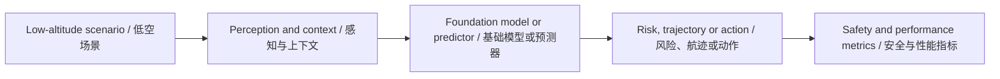

# 低空经济通用大模型前沿论文库 - 2026-07-15

> 此文件由自动化生成。它是待复核的外部情报，不是已经验证的科研结论。

## 数据源状态

- Only 2 of 10 papers had a downloadable, extractable PDF

## 今日核心发现

- 候选论文 2 篇；成功完成 PDF 全文提取与页码校验 2 篇。
- 主题分布以 Edge, Foundation/LLM 为主。
- 所有数值、数据集、Baseline 与局限仅在存在可回查英文证据片段时展示。

## Top 10 阅读优先级

| 排名 | 中文标题 | English Title | 全文状态 | 核心图 |
| ---: | --- | --- | --- | --- |
| 1 | 面向高分辨率近距多光谱遥感影像的自监督训练 | Self-supervised training for high-resolution close-range multispectral remote sensing imagery | verified | not_found |
| 2 | 解析、搜索与确认：基于思维链推理与结构化空间记忆的免训练空中视觉对话导航 | Parse, Search, and Confirmation: Training-Free Aerial Vision-and-Dialog Navigation with Chain-of-Thought Reasoning and Structured Spatial Memory | verified | found |

## 主题与方法分布

<svg xmlns="http://www.w3.org/2000/svg" viewBox="0 0 760 122" role="img" aria-label="Topic and Method Distribution / 主题与方法分布" style="max-width:100%;background:#0f172a;border-radius:12px"><text x="16" y="26" fill="#f8fafc" font-size="17" font-weight="700">Topic and Method Distribution / 主题与方法分布</text><text x="16" y="58" fill="#cbd5e1" font-size="14">Edge</text><rect x="180" y="42" width="500" height="20" rx="5" fill="#2dd4bf"/><text x="690" y="58" fill="#e2e8f0" font-size="13">1</text><text x="16" y="92" fill="#cbd5e1" font-size="14">Foundation/LLM</text><rect x="180" y="76" width="500" height="20" rx="5" fill="#2dd4bf"/><text x="690" y="92" fill="#e2e8f0" font-size="13">1</text></svg>

## 证据深度统计

<svg xmlns="http://www.w3.org/2000/svg" viewBox="0 0 760 88" role="img" aria-label="Evidence Depth / 证据深度" style="max-width:100%;background:#0f172a;border-radius:12px"><text x="16" y="26" fill="#f8fafc" font-size="17" font-weight="700">Evidence Depth / 证据深度</text><text x="16" y="58" fill="#cbd5e1" font-size="14">全文核验</text><rect x="180" y="42" width="500" height="20" rx="5" fill="#2dd4bf"/><text x="690" y="58" fill="#e2e8f0" font-size="13">2</text></svg>

## 当日整体技术路线图



## 研究空白与实验建议

1. 统一比较跨场景泛化：固定数据划分，比较 in-domain、cross-city 与极端天气性能。
2. 补齐不确定性与安全闭环：同时报告预测误差、校准误差、碰撞/冲突风险和推理延迟。
3. 检验通用模型的真实增益：以轻量专用模型为 Baseline，做参数量、数据规模、工具调用与消融实验。

网页版本：https://smallopen123.github.io/mobile-paper-library/2026-07-15/

## Top 1. 面向高分辨率近距多光谱遥感影像的自监督训练

**English Title:** Self-supervised training for high-resolution close-range multispectral remote sensing imagery

- Authors: Leon-Friedrich Thomas, Mikael Änäkkälä, Antti Lajunen
- Source: arXiv cs.CV
- Published: 2026-07-13T10:31:35Z
- [Original Page](http://arxiv.org/abs/2607.11366v1) | [Available PDF](http://arxiv.org/pdf/2607.11366v1)
- Evidence scope: `fulltext`；分析引用页：1、2、3、4、5、6、7、8、9、10、11、12、13、14、15、16

### 中文摘要

尽管自监督学习为减少近距遥感中的标注工作量提供了一种有前景的方法，但由于数据有限，其在高分辨率多光谱无人机影像上的有效性仍未得到充分探索。本研究利用跨多个传感器、年份和区域采集的厘米级多光谱无人机影像，评估了用于精准农业的自监督预训练。基于Transformer的编码器使用动量对比v3和掩码自编码器，在结合msuav500K与新收集的芬兰农田多年无人机影像的协调数据集上进行预训练。预训练使用了四个光谱波段（绿、红、红边、近红外）以实现跨传感器兼容性。模型在WeedMap数据集上使用5%–100%的训练数据进行作物-杂草语义分割评估。以下两个子集作为下游任务：任务A（德国，RedEdge-M），在该任务中比较了所有预训练模型在部分和全微调下的表现；任务B（瑞士，Sequoia），在该任务中评估了任务A的最佳编码器。我们使用MoCo-v3预训练的Swin Transformer在两个任务上均取得了最强性能，超越了Doornbos等人基于msuav500K预发布版本预训练的Swin Transformer模型。我们的预训练Swin Transformer还展示了跨传感器和跨区域的泛化能力。此外，我们公开了一个来自芬兰的多年多光谱无人机数据集，以支持未来研究。

> [!info]- English Abstract
> Although self-supervised learning (SSL) offers a promising way to reduce annotation effort in close-range remote sensing, its effectiveness for high-resolution multispectral unmanned aerial vehicle (UAV) imagery remains underexplored due to limited data. This study evaluated SSL pretraining for precision agriculture using cm-scale multispectral drone imagery collected across multiple sensors, years, and regions. Transformer-based encoders were pretrained with Momentum Contrast v3 (MoCo-v3) and Masked Autoencoders on a harmonized dataset combining msuav500K with newly collected multi-year UAV imagery from agricultural fields in Finland. Pretraining used four spectral bands (Green, Red, Red-Edge, Near-Infrared) for cross-sensor compatibility. The models were evaluated on crop-weed semantic segmentation using the WeedMap dataset with 5--100% training data. The following two subsets served as downstream tasks: Task A (Germany, RedEdge-M), where all pretrained models were compared under partial and full fine-tuning, and Task B (Switzerland, Sequoia), where the best encoder from Task A was assessed. Our Swin Transformer pretrained with MoCo-v3 achieved the strongest performance on both tasks, surpassing the Swin Transformer model of Doornbos et al. pretrained on a pre-release of msuav500K. Our pretrained Swin Transformer further demonstrated cross-sensor and cross-region generalization. We additionally provide a public multi-year multispectral UAV dataset from Finland to support future research.

### 论文原始核心框图

<!-- CORE_FIGURE:eb68fb8e0d4927dd -->
未自动识别到论文核心框图；没有使用结果曲线或无关图片代替。

### AI 中文总结框图

> AI 总结框图，不是论文原图；依据论文第 1、2、3、4、5、6、7、8、9、10、11、12 页生成。

```mermaid
flowchart LR N0["输入/场景: 高分辨率多光谱无人机影像 (Green, Red, Red-Edge, NIR, 0.7-25 cm GSD)"] N1["核心模块: 自监督预训练 (MoCo-v3 用于 Swin Transformer; MAE 用于 ViT Small/Base)"] N2["机制: 动量对比学习 (MoCo-v3) 或 掩码重建 (MAE)"] N3["输出: 预训练编码器权重"] N4["下游任务: 作物-杂草语义分割 (WeedMap 数据集, 任务A: 德国 RedEdge-M, 任务B: 瑞士 Sequoia)"] N5["指标: mean IoU"] N0 --> N1 N1 --> N2 N2 --> N3 N3 --> N4 N4 --> N5
```

### 核心内容

- **研究问题：** 自监督预训练能否提升高分辨率多光谱无人机影像在精准农业作物-杂草语义分割任务上的性能，尤其是在低数据场景下？
- **核心假设：** 未明确陈述核心假设，但论文提出了三个可检验的假设：(i) 在msuav500k+N上的自监督预训练能提升下游任务A的语义分割性能，尤其在低数据场景下，优于从头训练和ImageNet预训练；(ii) 最佳自监督预训练模型能实现跨地理和跨传感器泛化；(iii) 最佳自监督预训练模型优于Doornbos等人基于msuav500K预训练的Swin Transformer。
- **方法与理论链路：** 数据收集与预处理（芬兰农田多年多光谱无人机影像，MicaSense RedEdge 3相机，50m和10m飞行高度）→ 数据协调与扩展（与msuav500K合并，保留绿、红、红边、近红外四个波段，8-bit缩放）→ 自监督预训练（MoCo-v3用于Swin Transformer；MAE用于ViT Small和ViT Base，400 epochs）→ 下游任务评估（WeedMap数据集，任务A德国RedEdge-M，任务B瑞士Sequoia；5%-100%训练数据；Wasserstein距离优化数据划分）→ 性能比较（与从头训练、ImageNet预训练、Doornbos等人预训练对比；冻结/解冻编码器；指标：mean IoU）
- **为什么前沿：** 首次在扩展的msuav500k+N多传感器多区域多光谱无人机数据集上系统评估MoCo-v3和MAE自监督预训练，并验证了Swin Transformer在低数据场景下的显著优势，同时公开了芬兰农田高分辨率多光谱数据集。

### 数据集、Baselines 与 Metrics

**Datasets**
- msuav500K（PDF 第 4 页；证据："The newly released foundation dataset msuav500K includes high-resolution RGB and multispectral imagery collected using UAV-mounted sensors."）
- Self-collected dataset (Finland)（PDF 第 4 页；证据："Data collection was performed using a custom-built hexacopter equipped with a MicaSense RedEdge 3 camera developed by the Agrotechnology Research Group at the University of Helsinki."）
- WeedMap (Task A: Germany, RedEdge-M)（PDF 第 5 页；证据："For downstream task A evaluation, we used the publicly available WeedMap dataset introduced by Sa et al. [5]. The dataset was collected in agricultural fields in Germany and Switzerland at a flight altitude of 10 m using a UAV-mounted camera, resulting in a GSD of approximately 1 cm."）

**Baselines**
- Scratch (random initialization)（PDF 第 9 页；证据："the scratch-trained model achieved an IoU of 0.33 compared with 0.45–0.48 for pretrained models"）
- ImageNet-pretrained weights（PDF 第 9 页；证据："ImageNet-pretrained weights achieved the best performance at the 5% training data split"）

**Metrics**
- mean IoU（PDF 第 8 页；证据："All models were evaluated on a spatially independent test dataset of 280 image chips on mean IoU"）

### 主要结果与页码

- Swin Transformer (MoCo-v3, msuav500k+N) 在任务A上表现最佳（PDF 第 9 页；证据："For the Swin Transformer, the variant pretrained with MoCo-v3 on msuav500k+N and fully unfrozen outperformed all other weight configurations on the 5–25% data splits and remained competitive across the 50–100% training data volume"）

### 局限与证据边界

- ImageNet预训练权重仍具竞争力（PDF 第 12 页；证据："One consistent observation is that ImageNet-pretrained weights remain highly competitive."）
- 预训练数据集的异质性（PDF 第 12 页；证据："Another consideration is the heterogeneity of the pretraining dataset. Although msuav500K+N spans multiple sensors and geographic regions, differences in spectral-band centers, bandwidths, and flight conditions introduce variability that can complicate representation learning."）
- 极端地面采样距离变化（PDF 第 12 页；证据："the msuav500K dataset covers an extreme GSD range from 0.1–25 cm, corresponding to a scale variation of roughly 250 times"）
- 高数据场景下优势减弱（PDF 第 12 页；证据："In higher-data regimes, the performance advantage over ImageNet-pretrained weights or scratch end-to-end diminishes"）

- **与研究方向的联系：** 论文聚焦于低空（无人机）场景下的多光谱遥感影像，使用自监督预训练（MoCo-v3、MAE）和Transformer架构（Swin Transformer、ViT），应用于精准农业中的作物-杂草语义分割，属于低空场景中的大规模预训练方法研究，符合研究范围。
- **可复现方案：** 可复现条件：公开的msuav500K数据集、新公开的芬兰农田数据集（Zenodo）、WeedMap数据集；MoCo-v3和MAE框架；Swin-s3_tiny_224、ViT Small/Base (Patch 16)架构；单GPU训练（MoCo-v3 200 epochs，MAE 400 epochs）；Wasserstein距离优化数据划分。最小复现实验：在任务A（WeedMap德国RedEdge-M）上，使用MoCo-v3预训练Swin Transformer，5%训练数据，解冻编码器，评估mean IoU。
- **博士研究构想：** 假设：在低空多光谱无人机影像上，使用尺度感知的掩码自编码器（Scale-MAE）进行自监督预训练，能比标准MAE和MoCo-v3更好地处理msuav500K中0.1-25cm的极端地面采样距离变化，从而提升下游语义分割性能。可证伪实验：在msuav500k+N上预训练Scale-MAE（需估计或获取每张影像的GSD），与本文MoCo-v3 Swin Transformer和MAE ViT在任务A和B上对比，使用5%-100%训练数据，评估mean IoU。

## Top 2. 解析、搜索与确认：基于思维链推理与结构化空间记忆的免训练空中视觉对话导航

**English Title:** Parse, Search, and Confirmation: Training-Free Aerial Vision-and-Dialog Navigation with Chain-of-Thought Reasoning and Structured Spatial Memory

- Authors: Yu Qi, Hongyu Li, Shaofei Huang, Tianrui Hui, Yaxiong Wang, Lechao Cheng, Zhun Zhong, Si Liu, Meng Wang
- Source: arXiv cs.CV
- Published: 2026-07-13T13:14:20Z
- [Original Page](http://arxiv.org/abs/2607.11529v1) | [Available PDF](http://arxiv.org/pdf/2607.11529v1)
- Evidence scope: `fulltext`；分析引用页：1、2、3、4、5、6、7、8

### 中文摘要

本文针对资源高效的高空无人机导航任务，在免训练设置下解决空中视觉对话导航（AVDN）问题。直接应用多模态大语言模型（MLLM）会导致导航不可靠，原因在于方向定位能力弱且缺乏显式空间记忆。为解决这些问题，我们提出了PSC-AVDN，一个免训练框架，它将三阶段解析-搜索-确认推理流程与结构化空间记忆（SSM）紧密结合。解析阶段使用大语言模型（LLM）将模糊的对话指令转换为稳定的几何方向和目的地线索。搜索思维链（S-CoT）在高空观测下逐步进行目标探索，确认思维链（C-CoT）在候选区域周围进行细粒度验证以解决视觉歧义。同时，SSM集成了三种互补的空间线索来源，包括多尺度视觉观测、空间视觉记忆和结构化几何记忆，以提供全局空间上下文和长期一致性。在ANDH和ANDH-Full上的大量实验表明，PSC-AVDN在免训练设置下达到了新的最先进性能，匹配或超越了若干微调方法。代码将公开在：https://github.com/QY6616/PSC-AVDN

> [!info]- English Abstract
> In this paper, we tackle the Aerial Vision-and-Dialog Navigation (AVDN) task in the training-free setting for resource-efficient high-altitude UAV navigation.Naively applying MLLMs leads to unreliable navigation due to weak directional grounding and the lack of explicit spatial memory.To address these issues, we propose PSC-AVDN, a training-free framework that tightly couples a three-stage Parsing-Search-Confirmation reasoning pipeline with a Structured Spatial Memory (SSM).The parsing stage uses an LLM to convert ambiguous dialogue instructions into stable geometric directional and destination cues.A Search Chain-of-Thought (S-CoT) then performs stepwise target exploration under high-altitude observations, and a Confirmation Chain-of-Thought (C-CoT) conducts fine-grained verification around candidate regions to resolve visual ambiguity.Meanwhile, SSM integrates three complementary sources of spatial cues, including multi-scale visual observation, spatial visual memory, and structured geometric memory to provide global spatial context and long-horizon consistency.Extensive experiments on ANDH and ANDH-Full show that PSC-AVDN establishes new state-of-the-art performance in the training-free setting, matching or surpassing several finetuned methods.Code will be publicly available at: https://github.com/QY6616/PSC-AVDN

### 论文原始核心框图

<!-- CORE_FIGURE:6829f0a9054cc8ee -->
- Figure: Figure 2；PDF 第 4 页
- English Caption: Figure 2. The overall architecture of our proposed Parsing-Search-Confirmation framework for Aerial Vision-and-Dialog Navigation (PSC-AVDN). (a) The three-stage reasoning process first parses the destination and direction, followed by navigation through the step- wise reasoning chain (S-CoT and C-CoT), gradually searching and confirming the target location. (b) The Structured Spatial Memory (SSM) module provides multi-scale visual observation (MVO), spatial visual memory (SVM), and structured geometric memory (SGM) to enhance the search-confirmation process.
- 中文 Caption: 图2. 我们提出的用于空中视觉对话导航的解析-搜索-确认框架（PSC-AVDN）的整体架构。(a) 三阶段推理过程首先解析目的地和方向，然后通过逐步推理链（S-CoT和C-CoT）进行导航，逐步搜索和确认目标位置。(b) 结构化空间记忆（SSM）模块提供多尺度视觉观测（MVO）、空间视觉记忆（SVM）和结构化几何记忆（SGM），以增强搜索-确认过程。
- 选择理由：Caption 命中 framework, architecture；正文引用约 3 次；按标题匹配、引用次数和图形面积综合排序。

### AI 中文总结框图

> AI 总结框图，不是论文原图；依据论文第 4、5 页生成。

```mermaid
flowchart LR N0["输入/场景：高空无人机视角下的视觉对话导航任务，输入为对话指令和当前视觉观测"] N1["核心模块1：解析阶段（Parsing Stage）——使用LLM将模糊指令转换为几何方向和目的地线索，通过航向解析模块输出绝对角度"] N2["核心模块2：搜索阶段（Search Stage）——通过S-CoT进行逐步目标探索，包括目的地分析、场景理解、参考网格图生成和候选区域缩小"] N3["核心模块3：确认阶段（Confirmation Stage）——通过C-CoT在候选区域进行细粒度验证，输出边界框和置信度"] N4["辅助模块：结构化空间记忆（SSM）——集成MVO、SVM和SGM，提供全局空间上下文"] N5["输出：导航轨迹和最终目标位置"] N6["指标：SPL、SR、GP"] N0 --> N1 N1 --> N2 N2 --> N3 N3 --> N4 N4 --> N5 N5 --> N6
```

### 核心内容

- **研究问题：** 如何在免训练设置下，利用多模态大语言模型实现资源高效的高空无人机视觉对话导航，以解决方向定位弱和缺乏显式空间记忆的问题？
- **核心假设：** 未明确陈述核心假设，但隐含假设为：通过将模糊指令解析为几何线索、设计结构化思维链推理以及引入多源结构化空间记忆，可以弥补MLLM在高空场景下的方向定位和空间记忆缺陷，从而实现免训练的高效导航。
- **方法与理论链路：** 1. 解析阶段：使用通用LLM从对话指令中提取方向和目的地线索，并通过航向解析模块将多种方向格式转换为一致的角度表示。2. 搜索阶段：设计搜索思维链（S-CoT），将目标搜索分解为四个子推理步骤（目的地分析、场景理解、参考网格图生成、候选区域逐步缩小）。3. 确认阶段：引入确认思维链（C-CoT），在候选区域进行细粒度验证，通过可解释推理链排除错误候选并确认唯一目标。4. 结构化空间记忆（SSM）：集成多尺度视觉观测、空间视觉记忆和结构化几何记忆，提供全局空间上下文和长期一致性。
- **为什么前沿：** 首次在AVDN任务中探索免训练框架，通过三阶段结构化推理（解析-搜索-确认）和结构化空间记忆，无需任务特定训练即可实现与微调方法相当甚至更优的性能，解决了MLLM在高空场景下的方向定位和空间记忆缺陷。

### 数据集、Baselines 与 Metrics

**Datasets**
- ANDH（PDF 第 6 页；证据："The ANDH dataset contains 370 sub-trajectories in the seen validation set, 411 sub-trajectories in the unseen validation set, and 897 sub-trajectories in the unseen test set."）
- ANDH-Full（PDF 第 6 页；证据："the ANDH-Full dataset comprises 197 f"）

**Baselines**
- GPT-4o（PDF 第 6 页；证据："GPT-4o [33] 2.6 2.7 -9.5 3.4 3.9 -11.8 2.6 2.9 -15.5 2.5 2.5 -5.7 2.8 3.3 -15.0 1.8 1.9 -10.2"）
- Qwen-VL-Max（PDF 第 6 页；证据："Qwen-VL-Max [2] 8.5 8.6 3.6 8.7 9.2 5.5 5.7 6.2 6.7 9.3 9.6 5.2 6.8 7.0 9.1 6.4 6.9 1.6"）
- E.T.（PDF 第 6 页；证据："E.T. [28] 12.1 14.1 50.1 14.3 16.6 51.9 11.3 13.3 51.7 2.2 3.1 51.3 2.5 3.7 48.9 1.9 2.8 60.7"）
- HAA-T（PDF 第 6 页；证据："HAA-T [7] 14.7 17.3 56.3 16.5 20.4 55.2 12.9 15.7 53.7 3.7 5.1 54.6 3.2 4.7 50.9 4.1 6.3 63.2"）
- LSTM（PDF 第 6 页；证据："LSTM [10] 9.0 10.3 31.9 13.3 14.1 35.9 9.7 10.8 40.4 1.0 1.0 43.8 3.2 3.7 48.7 1.8 1.9 56.4"）
- HAA-LSTM（PDF 第 6 页；证据："HAA-LSTM [7] 11.6 13.0 50.3 18.3 20.0 54.4 12.6 14.1 54.6 3.8 4.1 52.2 3.4 3.7 56.1 1.9 2.6 66.5"）
- TA-GAT（PDF 第 6 页；证据："TA-GAT [35] 12.9 16.0 56.9 18.8 23.3 54.3 15.1 18.7 56.5"）
- TA-GAT w/ at（PDF 第 6 页；证据："TA-GAT w/ at [35] 14.8 18.2 58.8 17.8 21.1 61.7 15.9 19.7 56.3"）
- FELA（PDF 第 6 页；证据："FELA [36] 15.1 18.8 60.8 17.2 20.6 63.0 16.4 20.3 56.7"）
- FELA w/ at（PDF 第 6 页；证据："FELA w/ at [36] 15.3 18.8 60.7 19.2 23.9 64.1 17.6 21.9 61.4"）
- OpenFly（PDF 第 6 页；证据："OpenFly [9] 14.1 21.9 44.5 16.4 20.1 47.2 16.2 15.2 52.2 14.0 10.1 61.0 12.4 15.0 59.0 8.3 13.3 54.3"）

**Metrics**
- 未从可核验原文片段中确认。

### 主要结果与页码

- ANDH Unseen Val. SPL（PDF 第 6 页；证据："PSC-AVDN (Ours) 16.3 18.6 37.4 17.8 22.6 39.2 13.5 16.4 28.2 19.1 22.3 75.1 12.4 15.4 62.3 12.1 14.4 54.5"）
- ANDH Unseen Test SPL（PDF 第 6 页；证据："PSC-AVDN (Ours) 16.3 18.6 37.4 17.8 22.6 39.2 13.5 16.4 28.2 19.1 22.3 75.1 12.4 15.4 62.3 12.1 14.4 54.5"）
- ANDH-Full Unseen Val. SPL（PDF 第 6 页；证据："PSC-AVDN (Ours) 16.3 18.6 37.4 17.8 22.6 39.2 13.5 16.4 28.2 19.1 22.3 75.1 12.4 15.4 62.3 12.1 14.4 54.5"）

### 局限与证据边界

- 网格大小敏感性（PDF 第 8 页；证据："The results indicate that a 5 × 5 grid achieves the best performance, while both larger and smaller grids lead to clear degradation."）

- **与研究方向的联系：** 论文聚焦于低空/无人机场景（高空UAV导航），并利用通用大模型（LLM）和多模态大语言模型（MLLM）进行推理，属于低空场景中的大模型应用，符合研究范围。
- **可复现方案：** 可复现条件：代码将公开在GitHub（https://github.com/QY6616/PSC-AVDN），使用Qwen-VL-Max作为基础MLLM，ANDH和ANDH-Full数据集，最大执行步数3，5×5参考网格，尺度因子(3,5,7)，所有视觉补丁通过单应性变换为768×768像素。最小复现实验：在ANDH Unseen Val.集上复现表1中PSC-AVDN的SPL=17.8、SR=22.6、GP=39.2。
- **博士研究构想：** 可证伪的博士研究构想：假设在低空无人机导航中，引入动态更新的结构化空间记忆（如实时构建的语义地图）可以显著提升MLLM在长轨迹和多轮对话下的导航成功率。实验设计：在ANDH-Full数据集上，比较PSC-AVDN与移除SSM模块的变体，预期SSM模块的移除会导致SPL和SR下降超过10%。
