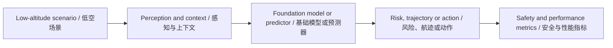

# 低空经济通用大模型前沿论文库 - 2026-07-17

> 此文件由自动化生成。它是待复核的外部情报，不是已经验证的科研结论。

## 数据源状态

- Only 1 of 10 papers had a downloadable, extractable PDF

## 今日核心发现

- 候选论文 1 篇；成功完成 PDF 全文提取与页码校验 1 篇。
- 主题分布以 Foundation/LLM 为主。
- 所有数值、数据集、Baseline 与局限仅在存在可回查英文证据片段时展示。

## Top 10 阅读优先级

| 排名 | 中文标题 | English Title | 全文状态 | 核心图 |
| ---: | --- | --- | --- | --- |
| 1 | 空间中的自我：无人机具身智能中自我意识与空间认知的基准测试 | Self in Space: Benchmarking Self-Awareness and Spatial Cognition in UAV Embodied Intelligence | verified | found |

## 主题与方法分布

<svg xmlns="http://www.w3.org/2000/svg" viewBox="0 0 760 88" role="img" aria-label="Topic and Method Distribution / 主题与方法分布" style="max-width:100%;background:#0f172a;border-radius:12px"><text x="16" y="26" fill="#f8fafc" font-size="17" font-weight="700">Topic and Method Distribution / 主题与方法分布</text><text x="16" y="58" fill="#cbd5e1" font-size="14">Foundation/LLM</text><rect x="180" y="42" width="500" height="20" rx="5" fill="#2dd4bf"/><text x="690" y="58" fill="#e2e8f0" font-size="13">1</text></svg>

## 证据深度统计

<svg xmlns="http://www.w3.org/2000/svg" viewBox="0 0 760 88" role="img" aria-label="Evidence Depth / 证据深度" style="max-width:100%;background:#0f172a;border-radius:12px"><text x="16" y="26" fill="#f8fafc" font-size="17" font-weight="700">Evidence Depth / 证据深度</text><text x="16" y="58" fill="#cbd5e1" font-size="14">全文核验</text><rect x="180" y="42" width="500" height="20" rx="5" fill="#2dd4bf"/><text x="690" y="58" fill="#e2e8f0" font-size="13">1</text></svg>

## 当日整体技术路线图



## 研究空白与实验建议

1. 统一比较跨场景泛化：固定数据划分，比较 in-domain、cross-city 与极端天气性能。
2. 补齐不确定性与安全闭环：同时报告预测误差、校准误差、碰撞/冲突风险和推理延迟。
3. 检验通用模型的真实增益：以轻量专用模型为 Baseline，做参数量、数据规模、工具调用与消融实验。

网页版本：https://smallopen123.github.io/mobile-paper-library/2026-07-17/

## Top 1. 空间中的自我：无人机具身智能中自我意识与空间认知的基准测试

**English Title:** Self in Space: Benchmarking Self-Awareness and Spatial Cognition in UAV Embodied Intelligence

- Authors: Zhishan Zou, Guoyan Sun, Zhiwei Wei, Jiancheng Pan, Yujie Li, Mugen Peng, Wenjia Xu
- Source: arXiv cs.CV
- Published: 2026-07-14T08:04:31Z
- [Original Page](http://arxiv.org/abs/2607.12477v2) | [Available PDF](http://arxiv.org/pdf/2607.12477v2)
- Evidence scope: `fulltext`；分析引用页：1、2、3、4、5、6、7、8、9、10、11、12、13、14、15、16、17、18、19、20、21、22、23、24、25、26、27、28、29、30、31、32、33、34

### 中文摘要

自主无人机系统越来越依赖多模态大语言模型在复杂的真实环境中运行。这种具身场景不仅需要理解周围空间，还需要保持对智能体自身的一致表征。然而，现有的无人机导向方法和基准测试仍然以环境为中心，主要关注空间理解任务，而智能体的自我意识仍然是隐式的。为了解决这一差距，我们引入了SIS-Bench，这是一个在统一的“空间中的自我”框架下评估无人机场景中具身空间智能的基准测试。SIS-Bench沿着两个互补维度（空间和自我）以及感知、记忆和推理三个层级组织评估。它包含来自1,646个真实世界无人机视频的4,856个问答对，这些问答对通过任务条件构建流程和专家验证生成。广泛的评估揭示了当前多模态大语言模型在建模动态和以智能体为中心的过程方面存在根本性限制。特别是，我们观察到空间认知和自我意识之间存在明显的不平衡，以及跨认知层级的渐进性能下降。受这些发现的启发，我们进一步探索了一种运动感知表示，该表示通过光流和视觉特征融合来整合与自我相关的动态。实验结果表明，对智能体运动进行建模一致地提升了感知和记忆性能，不仅在空间认知方面，在自我意识方面也是如此，并且可以泛化到下游的无人机决策任务。我们的结果强调了自我意识对于推进具身空间智能的重要性，并为运动感知的“空间中的自我”建模提供了新的基准和实证证据。

> [!info]- English Abstract
> Autonomous UAV systems increasingly rely on multimodal large language models (MLLMs) to operate in complex real-world environments. Such embodied scenarios require not only understanding the surrounding space but also maintaining a coherent representation of the agent itself. However, existing UAV-oriented approaches and benchmarks remain largely environment-centric, primarily focusing on spatial understanding tasks, with the agent's self-awareness remaining implicit. To address this gap, we introduce SIS-Bench, a benchmark for evaluating embodied spatial intelligence in UAV scenarios under a unified self-in-space formulation. SIS-Bench organizes evaluation along two complementary dimensions, space and self, and a three-level hierarchy of perception, memory, and reasoning. It contains 4,856 question--answer pairs across 13 tasks derived from 1,646 real-world UAV videos through a task-conditioned construction pipeline with expert verification. Extensive evaluations reveal that current MLLMs exhibit fundamental limitations in modeling dynamic and agent-centered processes. In particular, we observe a clear imbalance between spatial cognition and self-awareness, as well as a progressive performance degradation across cognitive levels. Motivated by these findings, we further explore a motion-aware representation that incorporates self-related dynamics through optical flow and visual feature fusion. Experimental results show that modeling agent motion consistently improves perception and memory performance, not only in spatial cognition but also in self-awareness, and generalizes to downstream UAV decision-making tasks. Our results highlight the importance of self-awareness for advancing embodied spatial intelligence, and provide both a new benchmark and empirical evidence for motion-aware self-in-space modeling.

### 论文原始核心框图

<!-- CORE_FIGURE:c681ee96fd0b53f7 -->
- Figure: Figure 4；PDF 第 9 页
- English Caption: Figure 4 Overview of the SIS-Motion framework. The architecture (left) comprises parallel encoders for synchronized visual and motion processing. The internal mechanism of the Motion Encoder is further elaborated on the right, showing the structural alignment of motion features into unified tokens compatible with large-scale language models.
- 中文 Caption: 图4 SIS-Motion框架概述。架构（左）包括用于同步视觉和运动处理的并行编码器。运动编码器的内部机制在右侧进一步阐述，显示了运动特征的结构对齐，使其成为与大语言模型兼容的统一令牌。
- 选择理由：Caption 命中 framework, architecture, overview；正文引用约 1 次；按标题匹配、引用次数和图形面积综合排序。

### AI 中文总结框图

> AI 总结框图，不是论文原图；依据论文第 6、9、10、11、12 页生成。

```mermaid
flowchart LR N0["输入/场景：真实世界无人机视频（AirScape, UrbanVideo-Bench, VisDrone）"] N1["核心模块：SIS-Bench基准（空间认知与自我意识两个维度，感知、记忆、推理三个层级）"] N2["机制：任务条件构建流程（数据处理→任务特定标注→QA构建→双专家验证）"] N3["评估：26个视频MLLM（6个专有模型，20个开源模型）在SIS-Bench上的Accuracy"] N4["发现：空间认知与自我意识不平衡，认知层级性能退化"] N5["改进：SIS-Motion框架（光流运动编码器 + 视觉特征融合）"] N6["输出：SIS-Motion在SIS-Bench上提升Spatial Avg和Self Avg，并迁移到下游OpenUAV导航任务"] N0 --> N1 N1 --> N2 N2 --> N3 N3 --> N4 N4 --> N5 N5 --> N6
```

### 核心内容

- **研究问题：** 当前多模态大语言模型在无人机具身智能场景中，如何联合建模外部环境（空间）和智能体自身状态（自我），以及显式建模运动信息能否改善这种联合建模？
- **核心假设：** 未明确陈述核心假设，但隐含假设为：显式建模与自我相关的运动信息（如光流）能够改善多模态大语言模型在无人机场景中对空间认知和自我意识的联合建模。
- **方法与理论链路：** 1. 构建SIS-Bench基准：从AirScape、UrbanVideo-Bench和VisDrone三个真实世界无人机视频源，通过数据处理、任务特定标注、QA构建和双专家验证四阶段流程，生成包含4,856个问答对的基准，覆盖空间认知和自我意识两个维度，以及感知、记忆和推理三个认知层级。2. 评估26个视频多模态大语言模型（6个专有模型和20个开源模型）在SIS-Bench上的性能。3. 提出SIS-Motion框架：在标准视频多模态大语言模型基础上，增加基于光流的运动编码器和轻量级连接器，将运动特征与视觉特征融合。4. 构建SIS-Motion-54K训练数据集，进行受控实验，比较零样本基线、仅视觉微调基线和SIS-Motion的性能。5. 在OpenUAV下游无人机导航任务上评估SIS-Motion的迁移能力。
- **为什么前沿：** 首次在无人机具身智能中明确将自我意识作为独立维度与空间认知并列评估，并构建了相应的基准测试SIS-Bench；提出了运动感知的SIS-Motion框架，通过显式建模自我运动信息来改善空间认知和自我意识的联合建模。

### 数据集、Baselines 与 Metrics

**Datasets**
- SIS-Bench（PDF 第 7 页；证据："SIS-Bench contains 4,856 multiple-choice question–answer pairs from 1,646 real-world UAV videos collected from AirScape [60], UrbanVideo-Bench [59], and VisDrone [54]."）
- SIS-Motion-54K（PDF 第 10 页；证据："To support motion-aware training, we construct SIS-Motion-54K from the AirScape [60] training split, strictly separated from SIS-Bench."）
- OpenUAV（PDF 第 12 页；证据："To further examine whether the benefit of motion-aware self-in-space modeling transfers beyond our benchmark, we evaluate on a downstream UAV navigation task built from OpenUAV [50]."）

**Baselines**
- ZeroShot（PDF 第 11 页；证据："Baseline ZeroShot 65.8 40.5 53.6"）
- SFT (visual-only)（PDF 第 11 页；证据："SFT 72.0 60.3 66.4"）
- Random（PDF 第 8 页；证据："Random 24.8 25.0 25.0"）
- Human Performance（PDF 第 8 页；证据："Human Performance 93.4 94.2 91.7"）

**Metrics**
- Accuracy (%)（PDF 第 8 页；证据："Accuracy (%) across 13 tasks on 6 proprietary models and 20 open-source models."）

### 主要结果与页码

- SIS-Motion改进效果（PDF 第 11 页；证据："SIS-Motion improves both Spatial Avg and Self Avg, from 72.0 to 74.2 and from 60.3 to 63.7, respectively."）
- 下游任务迁移（PDF 第 12 页；证据："To further examine whether the benefit of motion-aware self-in-space modeling transfers beyond our benchmark, we evaluate on a downstream UAV navigation task built from OpenUAV [50]."）

### 局限与证据边界

- 推理层级改进有限（PDF 第 28 页；证据："SIS-Motion supports this diagnosis: relative to the zero-shot backbone, it improves all nine perception and memory tasks, but its gains over visual-only SFT remain limited and inconsistent on the four reasoning tasks in Table 2."）
- 路径规划性能低于随机（PDF 第 28 页；证据："The below-random observation is therefore specific to Path Planning."）
- 运动建模未解决长时程推理（PDF 第 28 页；证据："Explicit local motion cues therefore reduce early-stage perception and tracking errors but do not resolve long-horizon temporal and ego-motion reasoning."）

- **与研究方向的联系：** 论文聚焦于低空场景（无人机）中的多模态大语言模型评估与改进，涉及具身智能、空间认知、自我意识、运动感知表示等核心概念，完全符合研究范围中“低空场景中的LLM、VLM、VLA、World Model、时空基础模型、Agent、安全评估与边缘部署”的要求。
- **可复现方案：** 可复现条件：1. 使用公开数据集AirScape、UrbanVideo-Bench和VisDrone；2. 使用公开的26个视频多模态大语言模型（6个专有和20个开源）；3. 使用公开的光流估计器（如RAFT、Sea-RAFT、MemFlow、MOFNet）。最小复现实验：在Qwen2.5-VL-3B模型上，使用SIS-Motion-54K数据集进行微调，在SIS-Bench上评估性能，并与论文报告的基线结果（零样本53.6%，仅视觉微调66.4%，SIS-Motion 69.1%）进行比较。
- **博士研究构想：** 可证伪的博士研究构想：在SIS-Bench框架下，假设引入更精细的自我运动表征（如结合IMU数据或6-DoF姿态估计）能够进一步缩小空间认知与自我意识之间的性能差距，尤其是在推理层级。可以通过在SIS-Motion框架中替换或增强运动编码器（例如，使用基于IMU的轨迹编码器或基于视觉的6-DoF姿态估计器），并在SIS-Bench的推理任务（如Action Prediction和Path Planning）上评估性能来验证。
