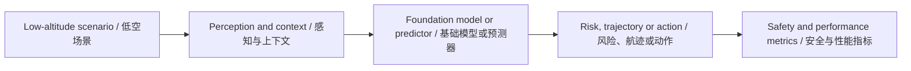
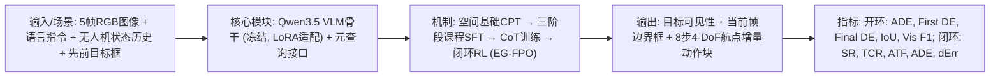

# 低空经济通用大模型前沿论文库 - 2026-07-18

> 此文件由自动化生成。它是待复核的外部情报，不是已经验证的科研结论。

## 数据源状态

- Only 1 of 10 papers had a downloadable, extractable PDF

## 今日核心发现

- 候选论文 1 篇；成功完成 PDF 全文提取与页码校验 1 篇。
- 主题分布以 Foundation/LLM 为主。
- 所有数值、数据集、Baseline 与局限仅在存在可回查英文证据片段时展示。

## Top 10 阅读优先级

| 排名 | 中文标题 | English Title | 全文状态 | 核心图 |
| ---: | --- | --- | --- | --- |
| 1 | CosFly-VLA：一种用于无人机跟踪的空间感知视觉-语言-动作模型 | CosFly-VLA: A Spatially Aware Vision-Language-Action Model for UAV Tracking | verified | found |

## 主题与方法分布

<svg xmlns="http://www.w3.org/2000/svg" viewBox="0 0 760 88" role="img" aria-label="Topic and Method Distribution / 主题与方法分布" style="max-width:100%;background:#0f172a;border-radius:12px"><text x="16" y="26" fill="#f8fafc" font-size="17" font-weight="700">Topic and Method Distribution / 主题与方法分布</text><text x="16" y="58" fill="#cbd5e1" font-size="14">Foundation/LLM</text><rect x="180" y="42" width="500" height="20" rx="5" fill="#2dd4bf"/><text x="690" y="58" fill="#e2e8f0" font-size="13">1</text></svg>

## 证据深度统计

<svg xmlns="http://www.w3.org/2000/svg" viewBox="0 0 760 88" role="img" aria-label="Evidence Depth / 证据深度" style="max-width:100%;background:#0f172a;border-radius:12px"><text x="16" y="26" fill="#f8fafc" font-size="17" font-weight="700">Evidence Depth / 证据深度</text><text x="16" y="58" fill="#cbd5e1" font-size="14">全文核验</text><rect x="180" y="42" width="500" height="20" rx="5" fill="#2dd4bf"/><text x="690" y="58" fill="#e2e8f0" font-size="13">1</text></svg>

## 当日整体技术路线图

## 研究空白与实验建议

1. 统一比较跨场景泛化：固定数据划分，比较 in-domain、cross-city 与极端天气性能。
2. 补齐不确定性与安全闭环：同时报告预测误差、校准误差、碰撞/冲突风险和推理延迟。
3. 检验通用模型的真实增益：以轻量专用模型为 Baseline，做参数量、数据规模、工具调用与消融实验。

网页版本：https://smallopen123.github.io/mobile-paper-library/2026-07-18/

## Top 1. CosFly-VLA：一种用于无人机跟踪的空间感知视觉-语言-动作模型

**English Title:** CosFly-VLA: A Spatially Aware Vision-Language-Action Model for UAV Tracking

- Authors: Ruilong Ren, Songsheng Cheng, Yunpeng Zhou, Hanxuan Chen, Xiangyue Wang, Tianle Zeng, Shuai Yuan, Binbo Li, Hanzhong Guo, Ji Pei, Da Zhang, Kangli Wang
- Source: arXiv cs.RO
- Published: 2026-07-16T13:52:08Z
- [Original Page](http://arxiv.org/abs/2607.15004v1) | [Available PDF](http://arxiv.org/pdf/2607.15004v1)
- Evidence scope: `fulltext`；分析引用页：1、2、3、4、5、6、7、8、9、10、11、12、13、14、15、16、17、18、19、20、21

### 中文摘要

动态目标跟踪对于在复杂城市环境中运行的无人机至关重要，其中目标和相机视角都在持续变化。现有的视觉-语言-动作策略可以有效跟踪可见目标，但当建筑物、植被或路边物体遮挡视线时，其性能通常会下降。在持续遮挡期间，策略可能会丢失目标状态，向错误区域执行动作，并通过后续观测放大此误差，直到无法重新捕获目标。为此，我们提出了CosFly-VLA，一种空间感知的VLA模型，它通过结构化预测接口联合定位目标、估计其可见性并生成连续飞行动作。为了训练此策略，我们使用了一个基于多样化数据源的大规模方案。在50万混合池上的空间基础持续预训练注入了无人机视角的深度、距离和3D空间推理。一个三阶段基于课程的监督微调过程通过多头预热，随后在自然和困难/长遮挡数据上进行两阶段课程学习，来专门化跟踪器。链式思维训练随后教授面向恢复的推理轨迹，然后输出结构化答案。最后，一个闭环强化学习阶段通过一个多组件奖励（涵盖对峙跟踪、定位质量、碰撞避免和任务成功）来优化跟踪行为。相对于OpenVLA，CosFly-VLA-0.8B在seen-test上将开环平均位移误差降低了34.1%，在unseen-test上降低了35.3%。闭环优化分别将成功率提高了29.8%和2.5%。这些结果展示了从可见帧模仿到空间基础动作闭环控制的进展，并在共享的oracle状态历史下进行评估。

> [!info]- English Abstract
> Dynamic target tracking is essential for Unmanned Aerial Vehicles (UAVs) operating in complex urban environments, where both the target and the camera viewpoint change continuously. Existing Vision-Language-Action (VLA) policies can track visible targets effectively, but their performance often degrades when buildings, vegetation, or roadside objects block the line of sight. During sustained occlusion, a policy may lose the target state, execute actions toward an incorrect region, and amplify this error through subsequent observations until re-acquisition becomes impossible. To this end, we present CosFly-VLA, a spatially aware VLA model that jointly grounds the target, estimates its visibility, and generates continuous flight actions through a structured prediction interface. To train this policy, we use a large-scale recipe over diverse data sources. Spatially Grounded Continued Pretraining (CPT) on a 500k mixed pool injects UAV-view depth, distance, and 3-D spatial reasoning. A three-stage Curriculum-based Supervised Fine-Tuning (SFT) process then specializes the tracker through multi-head warm-up followed by two-stage curriculum learning over natural and hard / long-occlusion data. Chain-of-Thought (CoT) training subsequently teaches recovery-oriented reasoning traces before structured answers. Finally, a closed-loop Reinforcement Learning (RL) stage optimizes tracking behavior with a multi-component reward covering stand-off tracking, grounding quality, collision avoidance, and task success. Relative to OpenVLA, CosFly-VLA-0.8B reduces open-loop Average Displacement Error (ADE) by 34.1% on seen-test and 35.3% on unseen-test. Closed-loop optimization improves Success Rate (SR) by 29.8% and 2.5%, respectively. These results demonstrate progress from visible-frame imitation toward spatially grounded action-closed-loop control, evaluated under a shared oracle state history.

### 论文原始核心框图

<!-- CORE_FIGURE:1ae894296efa9019 -->
- Figure: Figure 4；PDF 第 9 页
- English Caption: Figure 4: Closed-loop reinforcement learning pipeline. Starting from the SFT checkpoint, CosFly-VLA is served as an action-head policy in the CARLA environment. The rollout collector gathers multiple on-policy trajectories and one expert anchor for each start condition, computes rewards from stand-off distance, target IoU, success, and collision terms, and transfers the trajectories to the trainer. The trainer computes group-relative advantages, updates the trainable action head while the backbone remains frozen, and hot-reloads the updated head for the next collection round.
- 中文 Caption: 图4：闭环强化学习流程。从SFT检查点开始，CosFly-VLA在CARLA环境中作为动作头策略提供服务。回滚收集器为每个起始条件收集多个on-policy轨迹和一个专家锚点，根据对峙距离、目标IoU、成功和碰撞项计算奖励，并将轨迹传输给训练器。训练器计算组相对优势，更新可训练的动作头，同时骨干保持冻结，并热重载更新后的动作头以进行下一轮收集。
- 选择理由：Caption 命中 pipeline；正文引用约 1 次；按标题匹配、引用次数和图形面积综合排序。

### AI 中文总结框图

> AI 总结框图，不是论文原图；依据论文第 1、2、3、4、5、6、7、8、9、10、11、12、13、14、15、16、17、18、19、20、21 页生成。

### 核心内容

- **研究问题：** 如何使无人机在持续遮挡下仍能鲁棒地跟踪动态目标，即如何将遮挡鲁棒的无人机跟踪形式化为一个闭环恢复问题，使策略能够维持对不可见目标的空间假设、预测其可能重新出现的位置，并纠正由自身先前动作引起的误差？
- **核心假设：** 未明确陈述
- **方法与理论链路：** 任务形式化为闭环恢复问题；模型架构：Qwen3.5骨干+LoRA适配器+元查询接口+三个解耦头（流匹配DiT动作专家、MLP边界框头、MLP可见性头）；训练配方：空间基础持续预训练（CPT）→三阶段基于课程的监督微调（SFT）→链式思维（CoT）训练→闭环强化学习（RL，专家引导流策略优化EG-FPO）
- **为什么前沿：** 该论文将无人机跟踪重新定义为持续遮挡下的闭环恢复问题，而非可见帧跟随；提出了一个包含空间基础CPT、课程SFT、CoT训练和闭环RL的完整训练配方；在开环和闭环评估中均显著优于通用VLA基线（如OpenVLA、π0、π0.5）。

### 数据集、Baselines 与 Metrics

**Datasets**
- 内部无人机轨迹数据（PDF 第 7 页；证据："Internal UAV trajectory pipeline 350,000"）
- AirSpatial（PDF 第 7 页；证据："AirSpatial [76] 45,000"）
- Open3DVQA-v2（PDF 第 7 页；证据："Open3DVQA-v2 [13] 37,500"）
- HRVQA（PDF 第 7 页；证据："HRVQA [26] 30,000"）
- AVI-Math（PDF 第 7 页；证据："AVI-Math [77] 15,000"）
- AirCopBench（PDF 第 7 页；证据："AirCopBench [68] 11,250"）
- CapERA（PDF 第 7 页；证据："CapERA [3] 11,250"）
- 三阶段SFT数据（PDF 第 8 页；证据："Three-stage SFT 5,861 clean trajectories / 1,740,278 samples"）
- 长遮挡挖掘数据（PDF 第 8 页；证据："Long-occ mining 233,437 candidates"）
- CoT训练数据（PDF 第 8 页；证据："CoT training 19,066 samples"）
- RL数据（PDF 第 8 页；证据："RL 550 paths + 20 calibration / 104,250 frames"）

**Baselines**
- Gemini-3.1-Pro（PDF 第 11 页；证据："Gemini-3.1-Pro [14]"）
- Qwen3-VL-235B（PDF 第 11 页；证据："Qwen3-VL-235B [37]"）
- Qwen3.5-397B（PDF 第 11 页；证据："Qwen3.5-397B [38]"）

**Metrics**
- 交并比 (IoU)（PDF 第 11 页；证据："bbox Intersection-over-Union (IoU) is computed between the predicted and ground-truth current-frame boxes"）
- 中心误差 (Cen.)（PDF 第 11 页；证据："center error (Cen.) is the Euclidean pixel distance between their centers"）
- 可见性F1分数 (Vis F1)（PDF 第 11 页；证据："Visibility F1 (Vis F1) treats visible as the positive class and thresholds the predicted visibility probability at 0.5"）
- 成功率 (SR)（PDF 第 11 页；证据："Success Rate (SR) counts an episode as successful when its visible-frame rate is at least 0.8, it has no collision, and the final five rollout steps are visible"）
- 跟踪连续性比率 (TCR)（PDF 第 11 页；证据："Track Continuity Ratio (TCR) is the longest ..."）
- 距离误差 (dErr)（PDF 第 11 页；证据："stand-off distance error (dErr) ..."）

### 主要结果与页码

- 开环ADE降低 (seen-test)（PDF 第 1 页；证据："CosFly-VLA-0.8B reduces open-loop Average Displacement Error (ADE) by 34.1% on seen-test"）
- 开环ADE降低 (unseen-test)（PDF 第 1 页；证据："and 35.3% on unseen-test"）
- 闭环SR提升 (seen-test)（PDF 第 1 页；证据："Closed-loop optimization improves Success Rate (SR) by 29.8%"）

### 局限与证据边界

- 训练数据多样性有限（PDF 第 16 页；证据："the current training data is mainly collected from a limited set of simulated environments, maps, and target categories"）
- 目标行为相对简单（PDF 第 16 页；证据："target behavior in the present data remains relatively simple: most targets move with limited state variation, often at near-constant velocity"）
- 模型规模和方差分析不足（PDF 第 16 页；证据："the reported quantitative comparisons use the 0.8B model and aggregate split-level metrics; they do not establish one-to-one scaling to the 2B / 9B configurations or quantify multi-seed variance"）
- 闭环评估使用真实历史缓冲区（PDF 第 16 页；证据："the closed-loop benchmark also uses a shared ground-truth history buffer to isolate action-policy behavior, so robustness to predicted-box history feedback remains outside the present evaluation"）
- 所有评估均在仿真中进行（PDF 第 16 页；证据："all evaluations are conducted in simulation. The results therefore do not establish robustness under physical UAV dynamics, onboard sensing noise, communication latency, real occluders, or safety constraints in deployment"）

- **与研究方向的联系：** 论文明确聚焦于低空场景（无人机）中的动态目标跟踪，并采用视觉-语言-动作（VLA）模型，完全符合研究范围中“低空/无人机/城市空中交通语境”和“通用大模型、基础模型或大规模预训练方法语境”的要求。
- **可复现方案：** 可复现条件：使用Qwen3.5作为骨干，LoRA适配器（r=16, α=32, dropout 0.05），DiT动作专家，元查询池化（16动作、16边界框、1可见性查询），8步流积分推理；优化使用bf16、DeepSpeed ZeRO-2、AdamW、余弦学习率调度，有效批量大小32。最小复现实验：在CARLA模拟器中，使用Town10HD地图和行人目标，遵循论文描述的CPT→三阶段SFT→CoT训练→闭环RL流程，训练CosFly-VLA-0.8B模型，并在开环和闭环评估协议下验证性能。
- **博士研究构想：** 可证伪的博士研究构想：在CosFly-VLA的基础上，引入一个显式的、可学习的“遮挡记忆”模块，该模块不仅维持目标的空间假设，还能编码遮挡物的几何和语义信息（例如，通过隐式神经表示）。假设是，与仅依赖历史轨迹和场景布局的隐式推理相比，显式建模遮挡物可以显著提高在复杂、非重复性遮挡场景（如目标穿过多个不同形状的建筑物或植被区域）下的重新捕获成功率。可以通过在CARLA中设计包含多样化遮挡物布局的测试场景，并比较CosFly-VLA与添加了遮挡记忆模块的变体在闭环成功率上的差异来证伪。
