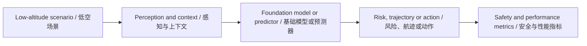

# 低空经济通用大模型前沿论文库 - 2026-07-20

> 此文件由自动化生成。它是待复核的外部情报，不是已经验证的科研结论。

## 数据源状态

- Only 1 of 20 requested papers were available
- Only 1 of 10 papers had a downloadable, extractable PDF

## 今日核心发现

- 候选论文 1 篇；成功完成 PDF 全文提取与页码校验 1 篇。
- 主题分布以 Foundation/LLM 为主。
- 所有数值、数据集、Baseline 与局限仅在存在可回查英文证据片段时展示。

## Top 10 阅读优先级

| 排名 | 中文标题 | English Title | 全文状态 | 核心图 |
| ---: | --- | --- | --- | --- |
| 1 | 认识自我，理解世界：基于多模态大模型的无人机时空推理双认知基准 | Knowing the Self, Understanding the World: A Dual-Cognition Benchmark for UAV Spatio-temporal Reasoning with MLLMs | verified | found |

## 主题与方法分布

<svg xmlns="http://www.w3.org/2000/svg" viewBox="0 0 760 88" role="img" aria-label="Topic and Method Distribution / 主题与方法分布" style="max-width:100%;background:#0f172a;border-radius:12px"><text x="16" y="26" fill="#f8fafc" font-size="17" font-weight="700">Topic and Method Distribution / 主题与方法分布</text><text x="16" y="58" fill="#cbd5e1" font-size="14">Foundation/LLM</text><rect x="180" y="42" width="500" height="20" rx="5" fill="#2dd4bf"/><text x="690" y="58" fill="#e2e8f0" font-size="13">1</text></svg>

## 证据深度统计

<svg xmlns="http://www.w3.org/2000/svg" viewBox="0 0 760 88" role="img" aria-label="Evidence Depth / 证据深度" style="max-width:100%;background:#0f172a;border-radius:12px"><text x="16" y="26" fill="#f8fafc" font-size="17" font-weight="700">Evidence Depth / 证据深度</text><text x="16" y="58" fill="#cbd5e1" font-size="14">全文核验</text><rect x="180" y="42" width="500" height="20" rx="5" fill="#2dd4bf"/><text x="690" y="58" fill="#e2e8f0" font-size="13">1</text></svg>

## 当日整体技术路线图



## 研究空白与实验建议

1. 统一比较跨场景泛化：固定数据划分，比较 in-domain、cross-city 与极端天气性能。
2. 补齐不确定性与安全闭环：同时报告预测误差、校准误差、碰撞/冲突风险和推理延迟。
3. 检验通用模型的真实增益：以轻量专用模型为 Baseline，做参数量、数据规模、工具调用与消融实验。

网页版本：https://smallopen123.github.io/mobile-paper-library/2026-07-20/

## Top 1. 认识自我，理解世界：基于多模态大模型的无人机时空推理双认知基准

**English Title:** Knowing the Self, Understanding the World: A Dual-Cognition Benchmark for UAV Spatio-temporal Reasoning with MLLMs

- Authors: Like Liu, Zhengzheng Xu, Haitao He, Hongzhe Li, Shuchang Zhang, Dian Shao
- Source: arXiv cs.CV
- Published: 2026-07-17T17:59:56Z
- [Original Page](http://arxiv.org/abs/2607.16193v1) | [Available PDF](http://arxiv.org/pdf/2607.16193v1)
- Evidence scope: `fulltext`；分析引用页：1、2、3、4、5、6、7、8、9

### 中文摘要

多模态大语言模型在多种视觉-语言任务中取得了强劲性能，但其在无人机场景中的能力仍未得到充分探索。近期面向无人机的基准开始评估MLLM在航空场景中的表现，但它们通常聚焦于场景理解、事件识别或导航完成，而非联合评估无人机智能体所需的双认知能力：在多视角时空背景下同时推理无人机自身状态和外部环境。为填补这一空白，我们提出了UAV-DualCog，一个基于双认知视角构建的航空多视角时空推理基准。UAV-DualCog包含图像和视频任务，以联合评估自状态和环境状态推理，同时要求超越离散答案预测的空间或时间证据。我们还开发了一个自动化流水线，从场景级语义点云构建数据，生成一个可扩展的基准，包含多样场景、数百个地标和数千个问答样本。广泛评估表明，当前MLLM在无人机双认知方面仍远不可靠。自状态推理、视角变换、精确空间定位和时间区间定位是持续的瓶颈，通过思维/前沿模型和人类基线的额外验证确认了该基准对人类可理解但对现有模型具有挑战性。我们进一步从不相交场景构建了UAV-DualCog-Train，并通过轻量级优化探针表明它提供了有用的结构化监督，表明其不仅作为评估基准，也作为推进基于MLLM的无人机智能体的数据资源的价值。

> [!info]- English Abstract
> Multimodal large language models have achieved strong performance across diverse vision-language tasks, yet their capabilities in UAV scenarios remain insufficiently explored. Recent UAV-oriented benchmarks have begun to evaluate MLLMs in aerial scenarios, but they typically focus on scene understanding, event recognition, or navigation completion, rather than jointly assessing the dual-cognition capability required for UAV agents: reasoning about both the UAV's own state and the external environment in multiview spatio-temporal contexts. To address this gap, we present UAV-DualCog, a benchmark for aerial multiview spatio-temporal reasoning built on this dual-cognition perspective. UAV-DualCog includes both image and video tasks to jointly evaluate self-state and environment-state reasoning, while requiring spatial or temporal grounding beyond discrete answer prediction. We also develop an automated pipeline that constructs data from scene-level semantic point clouds, yielding a scalable benchmark with diverse scenes, hundreds of landmarks, and thousands of QA samples. Extensive evaluations show that current MLLMs remain far from reliable in UAV dual cognition. Self-state reasoning, viewpoint transformation, precise spatial grounding, and temporal interval localization are persistent bottlenecks, and additional validation with thinking/frontier models and a human baseline confirms that the benchmark is understandable to humans but challenging for existing models. We further construct UAV-DualCog-Train from disjoint scenes and show through a lightweight optimization probe that it provides useful structured supervision, suggesting its value not only as an evaluation benchmark but also as a data resource for advancing MLLM-based UAV agents. Project website and supplementary materials: https://uav-dualcog.lozumi.com

### 论文原始核心框图

<!-- CORE_FIGURE:5f38e6f469a5e885 -->
- Figure: Figure 1；PDF 第 2 页
- English Caption: Figure 1: Overview of UAV-DualCog, a benchmark for aerial multiview spatio-temporal reasoning. It explicitly formulates self-aware cognition and environment-aware cognition as two top-level evaluation dimensions. By developing an automatic construction pipeline, it utilize both image and video modalities to evaluate MLLM’s dual cognition ability.
- 中文 Caption: 图1：UAV-DualCog概述，一个用于航空多视角时空推理的基准。它明确将自认知和环境认知作为两个顶层评估维度。通过开发自动构建流水线，它利用图像和视频模态来评估MLLM的双认知能力。
- 选择理由：Caption 命中 overview, pipeline；正文引用约 1 次；按标题匹配、引用次数和图形面积综合排序。

### AI 中文总结框图

> AI 总结框图，不是论文原图；依据论文第 2、3、4 页生成。

```mermaid
flowchart LR N0["输入/场景：AerialVLN模拟器中的18个无人机场景，包含746个地标"] N1["核心模块：双认知形式化（自状态认知 + 环境状态认知）"] N2["机制：自动化数据构建流水线（场景扫描→地标收集→图像/视频任务生成）"] N3["输出：图像任务（4种）和视频任务（2种），要求输出边界框和时间区间"] N4["指标：Acc, mIoU, BBox@0.5, tIoU@50, F1@0.5"] N0 --> N1 N1 --> N2 N2 --> N3 N3 --> N4
```

### 核心内容

- **研究问题：** 当前多模态大语言模型在无人机场景中是否具备联合推理自身状态和外部环境的双认知能力？
- **核心假设：** 未明确陈述核心假设，但隐含假设为：当前MLLM在无人机双认知任务中表现不足，尤其是在自状态推理、视角变换、精确空间定位和时间区间定位方面存在瓶颈。
- **方法与理论链路：** 1. 双认知形式化：将无人机认知分为自状态认知和环境状态认知两个维度。2. 自动化数据构建流水线：从场景级语义点云中扫描场景、收集地标，通过可控视角采样、可见性检查和结构化标注生成图像和视频任务。3. 任务设计：包括4种图像任务（自相对位置推理、未来观测预测、环境相对位置推理、地标驱动动作决策）和2种视频任务（飞行行为识别、地标可见性识别）。4. 评估协议：使用统一提示、JSON模式、解析规则和指标，要求输出边界框和时间区间作为证据。5. 轻量级优化探针：使用UAV-DualCog-Train对Qwen3.5-4B进行两阶段优化，评估结构化监督的效果。
- **为什么前沿：** 首次从双认知视角系统评估MLLM在无人机场景中的时空推理能力，要求输出空间和时间证据（边界框和时间区间）而非仅离散答案，并构建了可扩展的自动化数据构建流水线。

### 数据集、Baselines 与 Metrics

**Datasets**
- 未从可核验原文片段中确认。

**Baselines**
- 未从可核验原文片段中确认。

**Metrics**
- Acc (Answer Accuracy)（PDF 第 5 页；证据："Acc m𝑠IoU@50 m𝑠IoU Acc m𝑠IoU@50 m𝑠IoU Acc m𝑠IoU@50 m𝑠IoU Acc m𝑠IoU@50 mIoU"）
- mIoU (mean Intersection over Union)（PDF 第 5 页；证据："Acc m𝑠IoU@50 m𝑠IoU Acc m𝑠IoU@50 m𝑠IoU Acc m𝑠IoU@50 m𝑠IoU Acc m𝑠IoU@50 mIoU"）
- BBox@0.5 (Bounding Box at IoU 0.5)（PDF 第 6 页；证据："BBox@0.5 Corr. mIoU Corr."）
- tIoU@50 (temporal IoU at 0.5)（PDF 第 7 页；证据："tIoU@50 mtIoU"）

### 主要结果与页码

- 未从可核验原文片段中确认。

### 局限与证据边界

- 模拟到真实的差距（PDF 第 4 页；证据："reducing the sim-to-real gap remains future work."）
- 视频任务性能不足（PDF 第 9 页；证据："reliable UAV multimodal systems still require explicit video-side supervision or cross-frame objectives."）
- 空间定位精度低（PDF 第 6 页；证据："precise spatial grounding remains substantially lower than answer accuracy."）

- **与研究方向的联系：** 论文聚焦于低空/无人机场景中的MLLM评估，明确涉及无人机智能体的自状态和环境状态推理，与博士研究重点中的低空场景、LLM/VLM、安全评估与边缘部署高度相关。
- **可复现方案：** 可复现条件：使用AerialVLN模拟器作为数据构建环境，公开项目网站和补充材料（https://uav-dualcog.lozumi.com）。最小复现实验：使用UAV-DualCog-Train对Qwen3.5-4B进行两阶段优化，评估指标包括图像选项准确率、BBox@0.5、mIoU，以及视频全局准确率、F1@0.5、mtIoU。
- **博士研究构想：** 可证伪的博士研究构想：在UAV-DualCog基准上，通过引入跨帧一致性目标或显式视频侧监督，能否显著提升MLLM在视频任务中的时间定位和可见性计数性能？具体可设计一个双流架构，分别处理自状态和环境状态，并加入时间注意力机制，验证其在UAV-DualCog视频任务上的提升。
